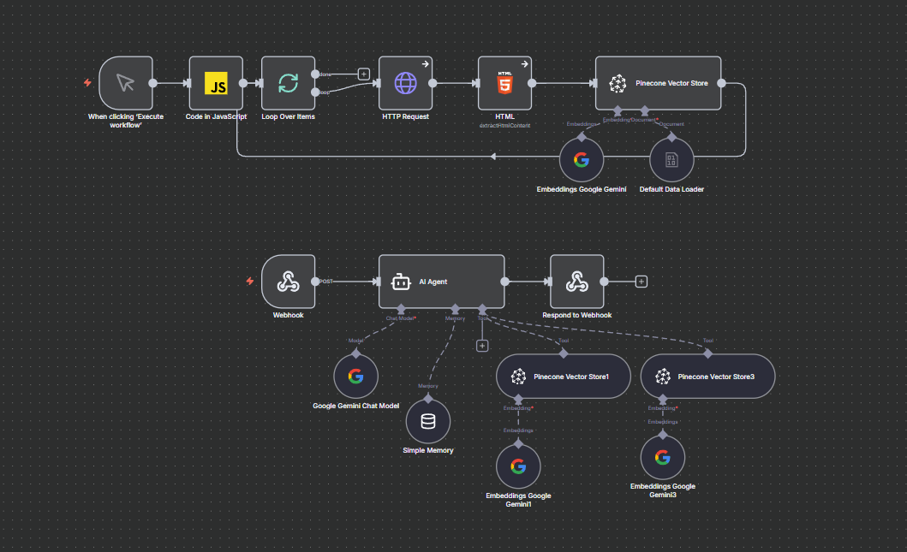
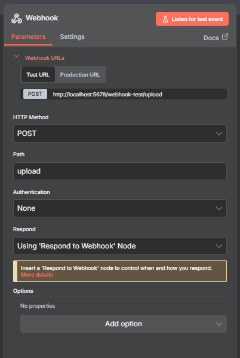
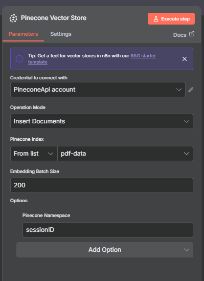
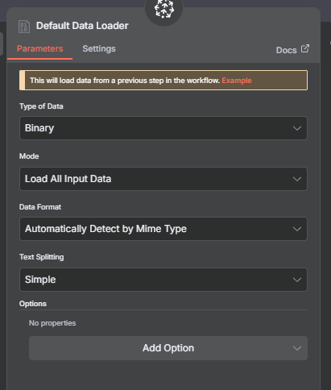

# rag-polman
prototype

setup n8n on docker
1. workflow chat

2. workflow upload

setting up webhook/upload

setting up pinecone dont forget to build pinecone index before use it

setting up respond to webhook

setting up data loader

done dont forget to activate this workflow!